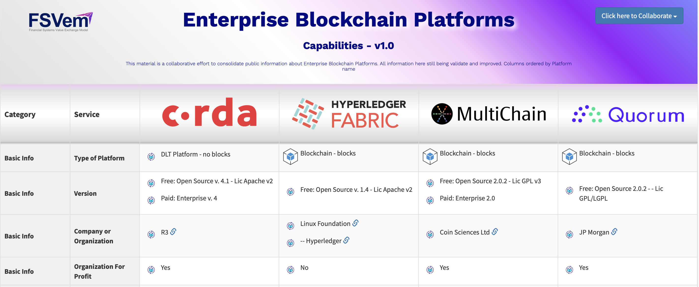

## Enterprise Blockchain Platforms - Capabilities

The project is open sourced to let fellow Blockchain Architects, IT Pros, Developers to feel free to contribute sending PRs to keep data up to date.

Our goal: Give a broad view about the main DLT/Blockchain platforms being used by enterprises to build business use cases, allowing technical professionals to have very quickly, a good understanding about the main differences about these platforms, and more important, how these differences might affect or not the requirements of the business use cases considering Blockchain as the underpinning technology.

 

## Contributing

Please read [CONTRIBUTING.md](https://gist.github.com/PurpleBooth/b24679402957c63ec426) for details on our code of conduct, and the process for submitting pull requests to us.

## Authors
Flavio Humberto de Almeida
This code is a fork of **Ilyas_IT83** - *Initial work* - [CloudComparer](https://github.com/ilyas-it83/CloudComparer/)

See also the list of [contributors](https://github.com/Flaviohumbertodealmeida/enterpriseblockchainplatforms/graphs/contributors) who participated in this project.

## License

This project is licensed under the MIT License - see the [LICENSE.md] (LICENSE.md) file for details

## Acknowledgments
